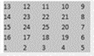
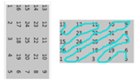

1. 给出策略打印旋转矩阵。


附加：类似的，同学们还可以思考如何实现顺时针旋转矩阵90&deg;？以及如何实现“之”字形打印矩阵（从左上角沿次对角线方向打印到右下角）？


* 方法一：按顺序遍历，即先从某个位置向右遍历，到达边沿之后向上遍历，继而向左向下......直至所有元素都被遍历完全。因此需要有一个与矩阵同等大小的矩阵记录每个元素是否被访问。

```c++
// 打印旋转矩阵
#include <iostream>
using namespace std;
#define N 5
int arr[N][N] = {
    {13,12,11,10,9},
    {14,23,22,21,8},
    {15,24,25,20,7},
    {16,17,18,19,6},
    {1, 2, 3, 4, 5}
};
// 初始化数组全部为0
int visited[N][N] = {0};
//标记行进方向：右上左下
int direction[4]={0,1,2,3};

int main(){
    int k = 0;//用于记录“碰壁”次数
    // 从左下角开始逆时针打印
    // 从哪里开始取决于最小元素位置，这里以左下角为例
    int i = N-1, j = 0;
    while(k < 4){
        // 打印当前位置
        cout << arr[i][j] << " ";
        // 标记当前位置已经访问
        visited[i][j] = 1;
        // 根据方向数组的值，判断下一步的位置
        switch(direction[k]%4){
            case 0://右
                // 如果下一步的位置已经访问过或过界，那么就改变方向
                if(visited[i][j+1] != 0 || j+1 >= N){
                    k++;
                    i--;
                }
                else{  //未访问过或未过界，那么就继续前进
                    j++;
                }
                break;
            case 1://上
                if(visited[i-1][j] != 0 || i-1 < 0){
                    k++;
                    j--;
                }
                else{
                    i--;
                }
                break;
            case 2://左
                if(visited[i][j-1] != 0 || j-1 < 0){
                    k++;
                    i++;
                }
                else{
                    j--;
                }
                break;
            case 3://下
                if(visited[i+1][j] != 0 || i+1 >= N){
                    k++;
                    j++;
                }
                else{
                    i++;
                }
                break;
        }
    }
    return 0;
}
```

* 方法二：每次遍历一行或一列，将遍历完毕的元素剔除，即重新定义边界，直至四个边界中两边界重合，若不重合，则更换方向重新遍历一行或一列。

```c++
// 打印旋转矩阵
#include <iostream>
using namespace std;
#define N 5
int arr[N][N] = {
    {13,12,11,10,9},
    {14,23,22,21,8},
    {15,24,25,20,7},
    {16,17,18,19,6},
    {1, 2, 3, 4, 5}
};
int WheatherCircle(int left, int right, int top, int bottom);

int main(){
    // 先定义边界
    int left = -1, right = N, top = -1, bottom = N;
    // 从左下角开始打印
    int i = N-1, j = 0;

    while(1){
        // 从底部由左向右打印
        while(j<right){
            cout << arr[i][j] << " ";
            j++;
        }
        bottom--;
        i--;
        j--;
        if(!WheatherCircle(left, right, top, bottom)) break;

        // 在右边由下向上打印
        while(i>top){
            cout << arr[i][j] << " ";
            i--;
        }
        right--;
        j--;
        i++;
        if(!WheatherCircle(left, right, top, bottom)) break;

        // 在上面由右向左打印
        while(j>left){
            cout << arr[i][j] << " ";
            j--;
        }
        top++;
        i++;
        j++;
        if(!WheatherCircle(left, right, top, bottom)) break;

        // 在左边由上向下打印
        while(i<bottom){
            cout << arr[i][j] << " ";
            i++;
        }
        left++;
        j++;
        i--;
        if(!WheatherCircle(left, right, top, bottom)) break;
    }
    return 0;
}

int WheatherCircle(int left, int right, int top, int bottom){
    if(left == right || top == bottom) return 0;
    else return 1;
}
```


2. 给出策略返回一个m*n矩阵中从【1,1】到【m,n】的和最小的一条路径。

* 方法一：最容易想到的就是动态规划，dp\[i]\[j]表示从(0, 0)到(i, j)的最小距离和，对于矩阵中的每个元素，到达该元素要么其左侧元素向右移动，要么其上方元素下移，那么状态转移方程为
  $$
  dp[i][j]=min(dp[i-1][j],dp[i][j-1])+arr[i][j]
  $$
  对于这个状态转移方程我们可以确定矩阵边缘的元素值：

$$
dp[0][j]=dp[0][j-1]+arr[0][j]
$$

$$
dp[i][0]=dp[i-1][0]+arr[i][0]
$$

```cpp
int dpMin(int** arr, int m,int n){
    // 先创建同尺寸的dp数组
    int** dp = new int*[m];
    for(int i=0;i<m;i++){
        dp[i]=new int[n];
    }
    // 初始化dp数组
    dp[0][0]=arr[0][0];
    for(int i=1;i<m;i++){
        dp[i][0]=dp[i-1][0]+arr[i][0];
    }
    for(int j=1;j<n;j++){
        dp[0][j]=dp[0][j-1]+arr[0][j];
    }
    // 递推
    for(int i=1;i<m;i++){
        for(int j=1;j<n;j++){
            dp[i][j]=min(dp[i-1][j],dp[i][j-1])+arr[i][j];
        }
    }
    // 打印dp数组
    /*
    for(int i=0;i<m;i++){
        for(int j=0;j<n;j++){
            cout<<dp[i][j]<<"\t";
        }
        cout<<endl;
    }
    */
    // 返回结果
    return dp[m-1][n-1];
}
```

* 方法二：使用递归的方式，计算从\[x]\[y]到\[m]\[n]的最小路径即是计算 min{\[x+1]\[y]，\[x]\[y+1]} 最小路径。

代码如下：

```cpp
int minPathSum(int** arr, int m,int n,int i,int j){
    // 打印下标
    // cout<<"["<<i<<","<<j<<"]"<<"->";
    // 递归出口
    if(i==m-1&&j==n-1){
        return arr[i][j];
    }
    // 递归
    if(i==m-1){
        return arr[i][j]+minPathSum(arr,m,n,i,j+1);
    }
    if(j==n-1){
        return arr[i][j]+minPathSum(arr,m,n,i+1,j);
    }
    int right = minPathSum(arr,m,n,i,j+1);
    int down = minPathSum(arr,m,n,i+1,j);
    return arr[i][j]+min(minPathSum(arr,m,n,i+1,j),minPathSum(arr,m,n,i,j+1));
}
```

